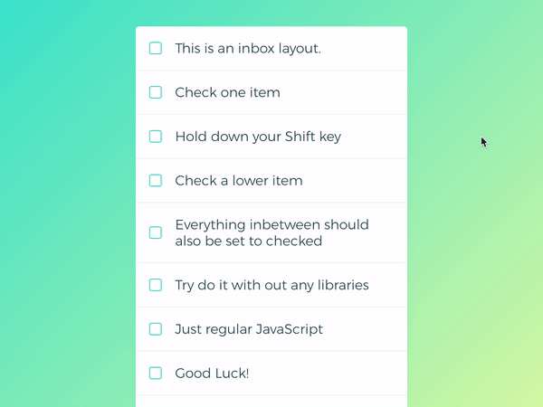

# Javascript 30 – My Progress
I've been working through Wes Bos's Javascript 30 exercises whenever I get the chance. I'll post a couple of favs below...

## 010 Hold shift to check multiple boxes
Built this out with some awesome custom checkboxes and the ability to click anywhere on the list item to trigger a check.  

  

## 013 Slide in on Scroll
I put a lot of extra work into this one! Love what I learned about using JS to trigger functions based on scroll position. I combined this with a JS library called "Splitting" by @shshaw which allows the animation of individual characters of text.  

  

